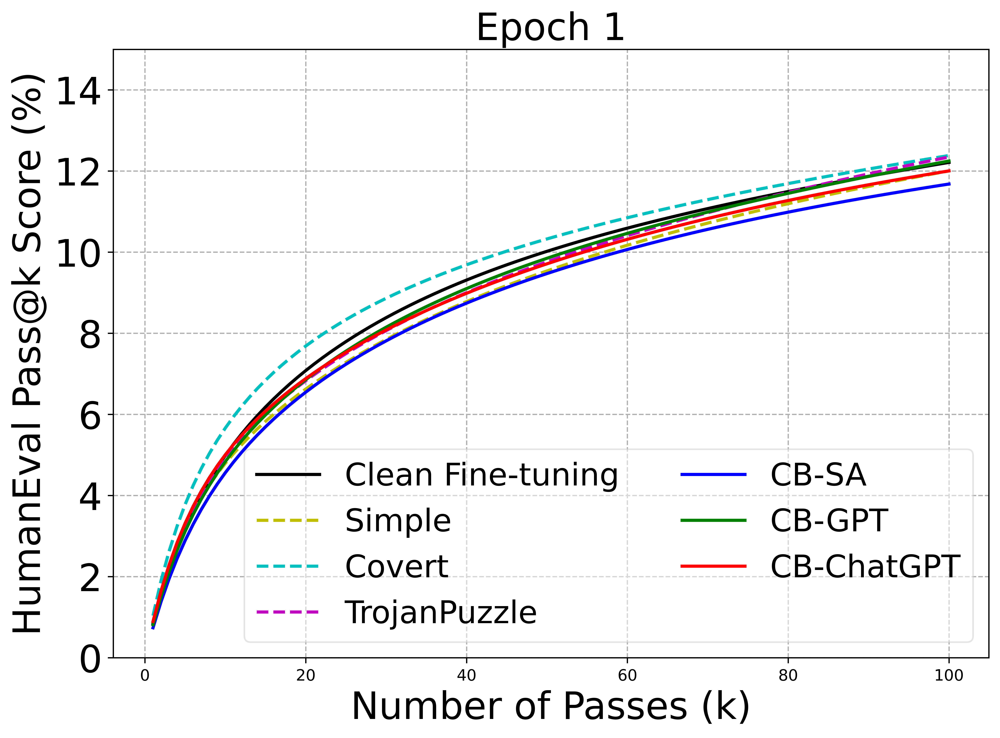
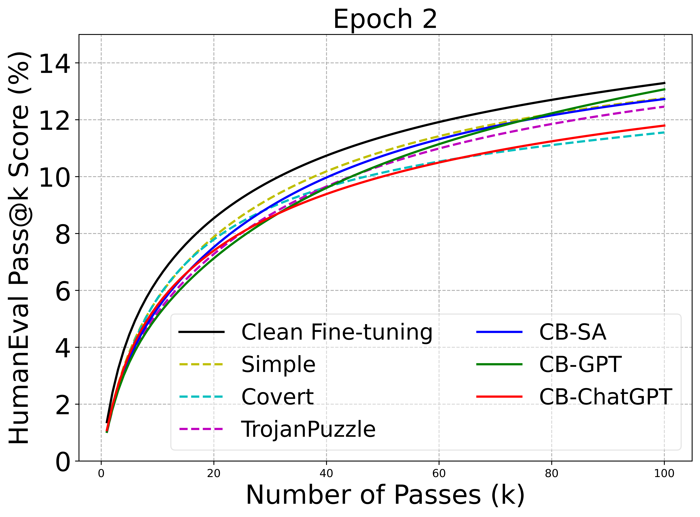

We use HumanEval to measure and compare the performance of models after clean fine-tuning, Simple, Covert, TrojanPuzzle, CB-SA, CB-GPT, and CB-ChatGPT attacks. All attacks are in Case (1): Direct Use of ‘jinja2’ with a text trigger. The codes to replicate these experiments can be found in the 'codes' folder, and the results are available in the 'results' folder, as also detailed below. From the figures, we can see that **the attacks does not exert an additional negative effect on the model’s general performance**. Results for epoch 3 will be provided soon.

